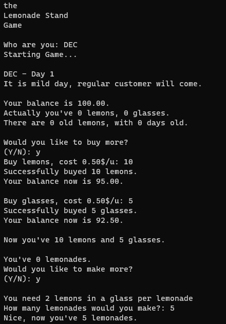
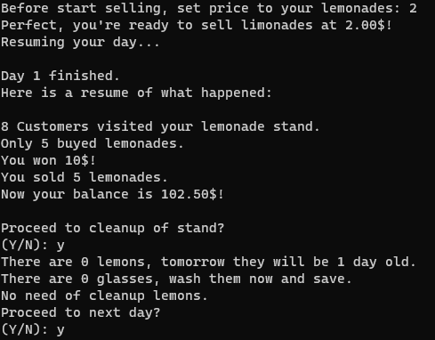

# the Lemonade Stand Game
> A console App by ***DeepSeek***.

## What's this game?
This is my submission for **W3Schools Community** *Challenges*.

It is built with `C` language. Being my first project with it. It works as a CLI, with I/O.

## How do I play it?
To play this game you will require:
- A **C** *Compiler*, like **MINGW**.

Then download this repo in a ZIP or just `main.c` file.
Then run it in your **Shell**:
```sh
gcc main.c -o main

./main.exe
```
If you use an Editor with C support, like **Code::Blocks**, you can run it directly by pressing `F5`.

## Preview of this game
Here you can see how play the game looks like:


---


If you like this project and want to support me, please, let to this repository a star.

*Progressively will update* this repository to fix errors I find.